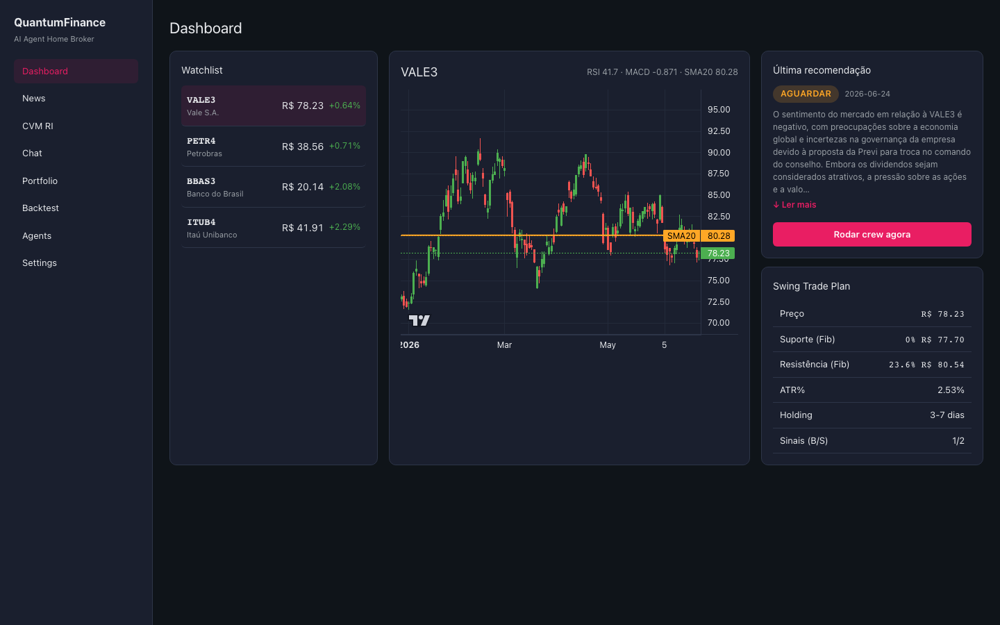
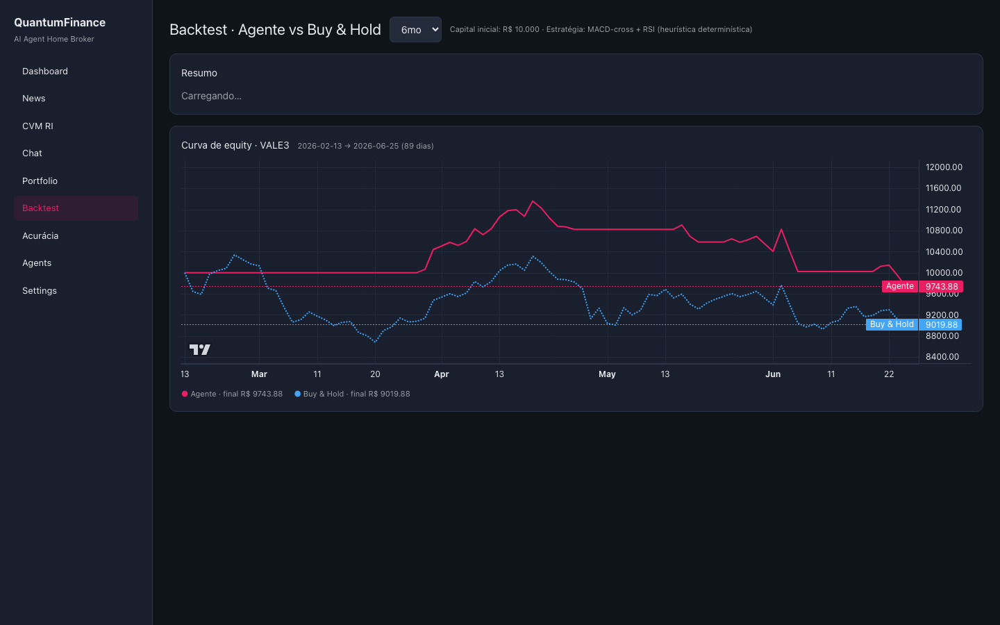
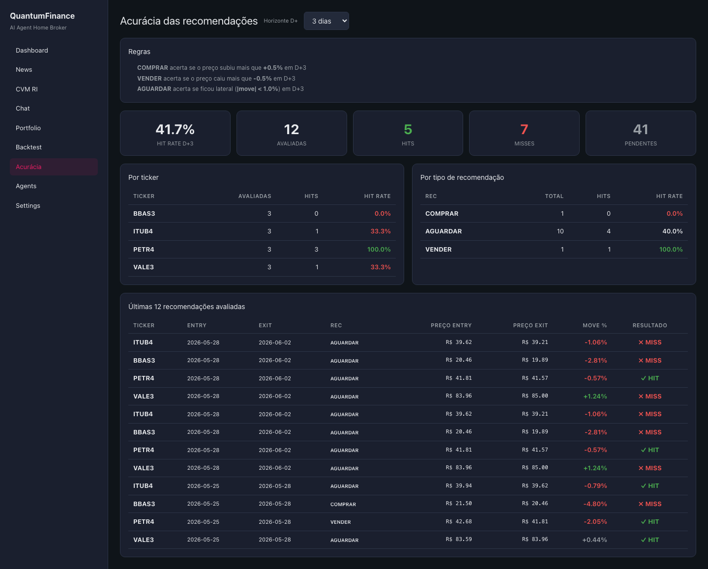
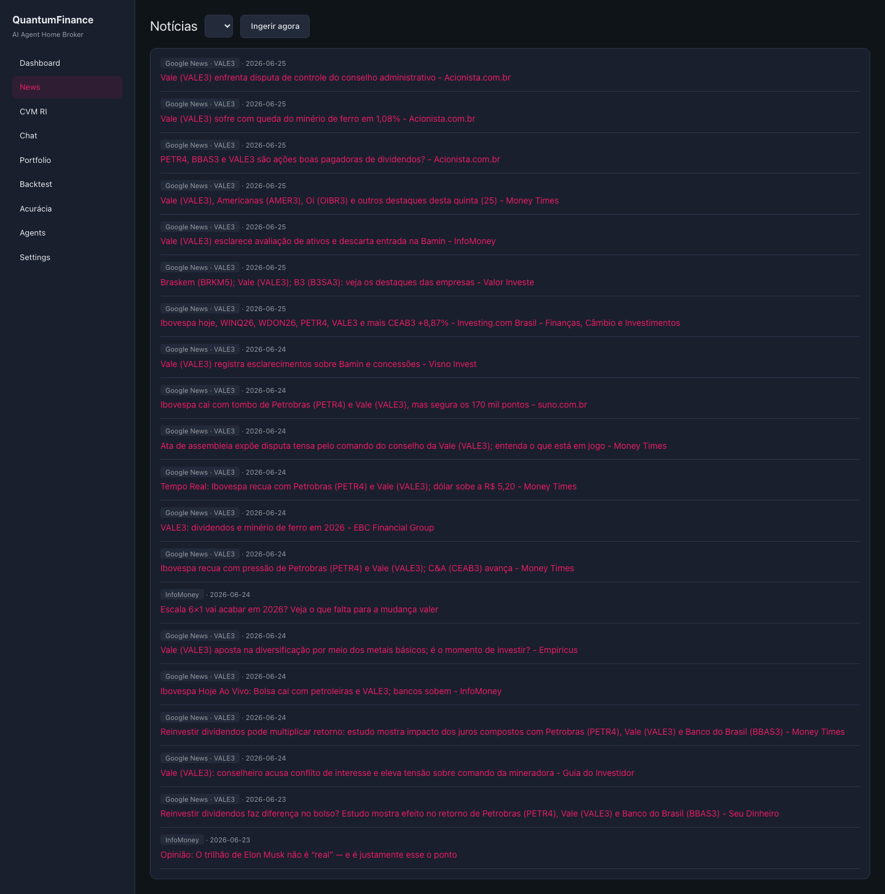
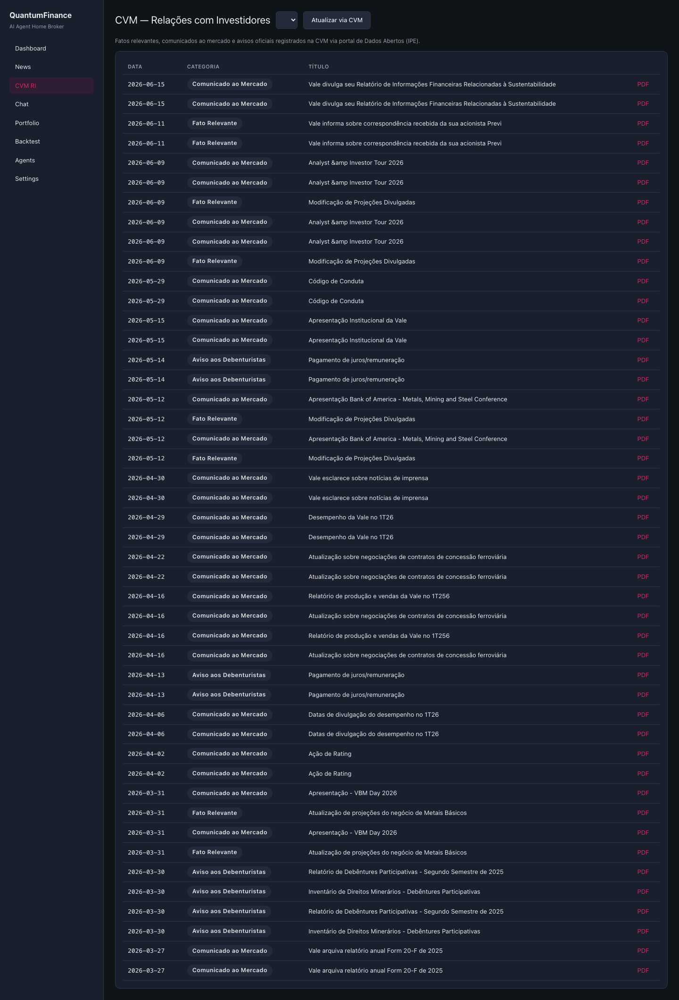
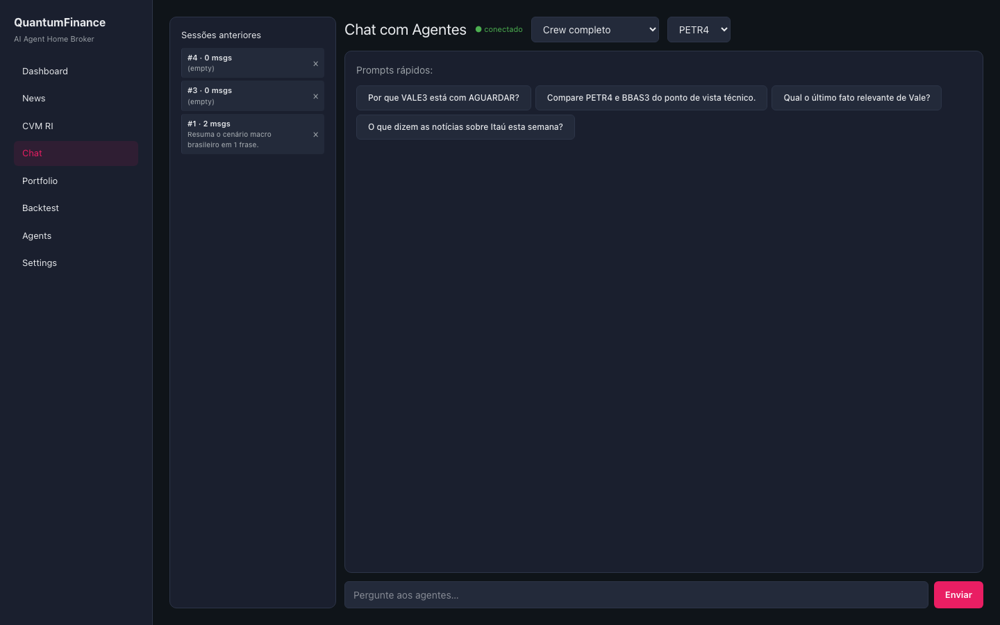
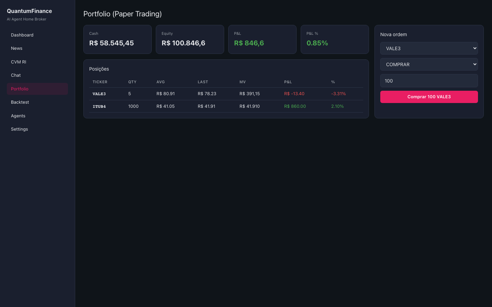
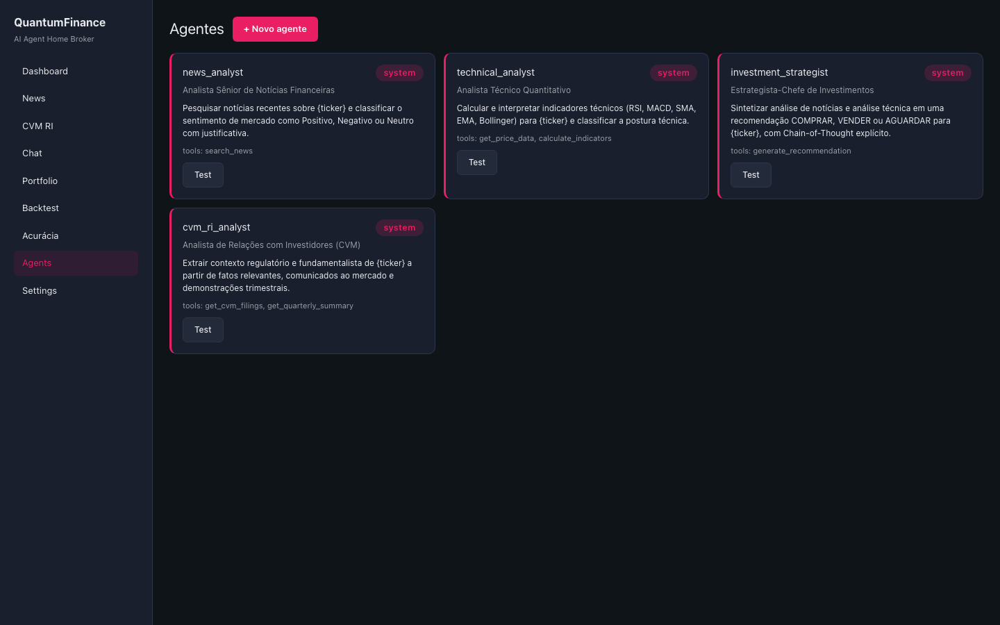
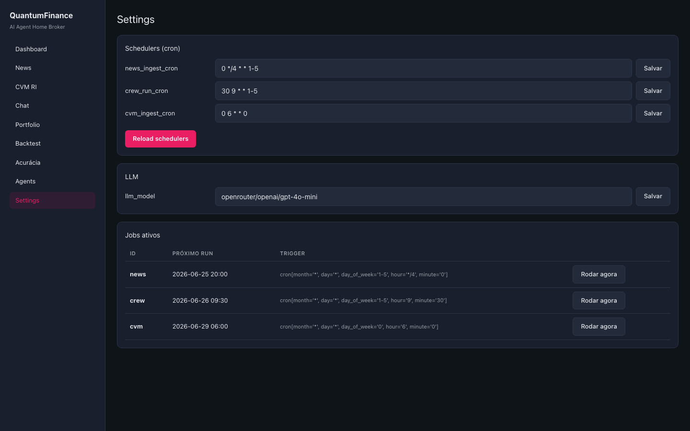

# QuantumFinance · AI Agent Home Broker

> **Projeto Integrado · MBA Data Science & AI · FIAP 2026**
> Sistema multi-agente (CrewAI) que combina notícias, indicadores técnicos e dados regulatórios da CVM para emitir recomendações diárias **COMPRAR / VENDER / AGUARDAR** sobre 4 ações da B3 — VALE3, PETR4, BBAS3, ITUB4.
> Entregue como **stack full-stack dockerizada** (FastAPI + React) — backend, frontend, dataset populado e documentação visual.

---

## Como executar (1 comando)

**Pré-requisitos:** Docker Desktop e Docker Compose (testado em macOS Apple Silicon).

```bash
# 1. Configure a chave da LLM (uma vez)
cp quantumfinance-app/backend/.env.example quantumfinance-app/backend/.env
# Edite o .env e preencha OPENROUTER_API_KEY com sua chave da openrouter.ai
# Gere uma chave gratuita em: https://openrouter.ai/settings/keys

# 2. Suba o stack
cd quantumfinance-app
docker compose up -d --build
```

**Acesse:**

| O que | URL |
|---|---|
| **Frontend (React)** | http://localhost:3000 |
| **Swagger UI (Try-it-out)** | http://localhost:8000/docs |
| **ReDoc** | http://localhost:8000/redoc |
| **Health check** | http://localhost:8000/api/health |

> A primeira build leva ~3–5 min (instala dependências Python + Node sob Rosetta). Depois fica em cache.

---

## Screenshots

### Dashboard — gráfico candlestick + última recomendação + plano swing


### Backtest — Agente vs Buy-and-Hold com curva de equity


### Acurácia — hit-rate D+N por ticker e tipo de recomendação


### News — ingestão de notícias multi-fonte (Google News + InfoMoney + Valor)


### CVM RI — fatos relevantes da CVM (IPE/ITR/DFP)


### Chat — interface conversacional com agentes via WebSocket


### Portfolio — carteira fictícia com ordens BUY/SELL


### Agents — CRUD dos agentes CrewAI


### Settings — schedulers cron, LLM, disparo manual de jobs


> Os screenshots ficam em `docs/screenshots/`. Para regerar (após qualquer mudança visual):
> ```bash
> cd quantumfinance-app/frontend && npx playwright test e2e/screenshots.spec.ts
> ```

---

## Onde verificar cada item do enunciado

Caminho rápido para o avaliador conferir cada requisito do enunciado oficial do **Projeto Integrado AI Agents v2** (FIAP MBA 2026).

### 1. Coleta e pré-processamento de dados

| Componente | URL na UI | Arquivo no backend |
|---|---|---|
| Preços OHLCV (yfinance) | http://localhost:3000 (gráfico candlestick no Dashboard) | `quantumfinance-app/backend/app/tools/prices.py` |
| Indicadores técnicos (RSI, MACD, SMA/EMA, Bollinger) | http://localhost:3000 (canto superior do gráfico) | `quantumfinance-app/backend/app/tools/indicators.py` |
| Notícias (Google News + InfoMoney + Valor via feedparser) | http://localhost:3000/news | `quantumfinance-app/backend/app/tools/news.py` |
| **Bônus**: CVM RI filings (IPE, ITR, DFP) | http://localhost:3000/cvm | `quantumfinance-app/backend/app/tools/cvm.py` |
| Endpoints REST | http://localhost:8000/docs → `tickers`, `chart`, `news`, `cvm` | `quantumfinance-app/backend/app/routes/` |

### 2. Análise de sentimento

| Componente | Onde |
|---|---|
| Agente `news_analyst` (LLM classifica sentimento) | UI: http://localhost:3000/agents (#1) · Backend: `app/agents/builder.py` (seed) + `app/db/seed.py` |
| Tool `search_news` consumida pelo agente | `app/tools/news.py:24` (decorator `@tool`) |
| LLM: OpenRouter → GPT-4o-mini (configurável) | `app/agents/llm.py` · `.env: LLM_MODEL` |

### 3. AI Agent com Tools (mínimo 3)

**6 tools** disponíveis (excede o mínimo):

| Tool | Arquivo |
|---|---|
| `search_news` | `app/tools/news.py` |
| `get_price_data` | `app/tools/prices.py` |
| `calculate_indicators` | `app/tools/indicators.py` |
| `generate_recommendation` | `app/tools/recommendation.py` |
| `get_cvm_filings` (bônus) | `app/tools/cvm.py` |
| `get_quarterly_summary` (bônus) | `app/tools/cvm.py` |

**Veja na UI**: http://localhost:3000/agents (4 agentes seed) — http://localhost:8000/api/agents/tools (lista JSON).

### 4. Recomendações COMPRAR / VENDER / AGUARDAR + Chain-of-Thought

| Componente | Onde verificar |
|---|---|
| Última recomendação + reasoning (CoT) | http://localhost:3000 (Dashboard, card "Última recomendação" com botão "Ler mais") |
| Histórico de recomendações | `GET http://localhost:8000/api/recommendations` |
| Disparo manual do crew (1 ticker) | UI: botão "Rodar crew agora" no Dashboard · API: `POST /api/recommendations/run` |
| Disparo manual do crew (todos os tickers) | UI: http://localhost:3000/settings → "Jobs ativos" → `crew` → "Rodar agora" |
| CoT armazenado (raw output do crew) | tabela `agent_runs` (`raw_output` field) — query via `sqlite3 quantumfinance-app/backend/data/app.db` ou `GET /api/recommendations/{ticker}/latest` |

### 5. Acurácia das recomendações (avaliação automática)

| Componente | Onde |
|---|---|
| Tela com KPIs + breakdown por ticker e por tipo + detalhe linha-a-linha | **http://localhost:3000/accuracy** |
| Endpoint | `GET http://localhost:8000/api/hit-rate?horizon_days=3` |
| Lógica | `quantumfinance-app/backend/app/tools/hit_rate.py` |
| Regras | COMPRAR acerta se subiu mais de 0.5%; VENDER acerta se caiu mais de 0.5%; AGUARDAR acerta se ficou lateral (variação absoluta menor que 1%) |
| Janelas testáveis | D+1, D+3, D+5, D+10 (selector na UI) |

### 6. Backtest vs Buy-and-Hold (opcional, valorizado)

| Componente | Onde |
|---|---|
| Tela com tabela + curva de equity | **http://localhost:3000/backtest** |
| API resumo (4 tickers) | `GET http://localhost:8000/api/backtest?period=6mo` |
| API detalhe + curva diária | `GET http://localhost:8000/api/backtest/{ticker}?period=6mo` |
| Estratégia | MACD-cross + RSI determinístico (documentado em `app/tools/backtest.py`) |
| Períodos suportados | `1mo`, `3mo`, `6mo`, `1y`, `2y` |

### 7. Interface conversacional (opcional)

| Componente | Onde |
|---|---|
| Chat com agentes (WebSocket) | http://localhost:3000/chat |
| Targets: Crew completo OU agente individual | Selector no topo da página de chat |
| Histórico de sessões + restaurar | Sidebar esquerda; click para restaurar mensagens |
| **Apagar sessões** | Botão `×` ao lado de cada sessão |
| Endpoint WS | `ws://localhost:8000/api/chat` |

---

## Bônus (criatividade — PDF página "O QUE MAIS")

| Bônus do enunciado | Status | Onde |
|---|---|---|
| Multi-agente (notícias + técnico + orquestrador) | **implementado** | "Investment Crew" (3 agentes) e "Deep Research Crew" (4 ag, inclui CVM RI) — http://localhost:3000/agents |
| Agente de explicabilidade | **implementado** | Campo `reasoning` em cada Recommendation é o output em linguagem natural do strategist |
| Comparador de carteiras por perfil de risco | **implementado** | http://localhost:3000/portfolio — 3 carteiras seed (Conservador / Moderado / Agressivo) com descrição e sugestão de tamanho de posição por perfil |
| Memória de longo prazo (vector store) | não implementado | — |
| Alertas Telegram/email | não implementado | — |

---

## Arquitetura

```
┌─────────────────────────────────────────────────────────┐
│ Frontend (React 19 + Vite + Tailwind + lightweight-charts)
│ nginx :3000 │
└──────────────────┬──────────────────────────────────────┘
│ HTTP / WebSocket (proxy via nginx)
↓
┌─────────────────────────────────────────────────────────┐
│ Backend (FastAPI + SQLAlchemy 2.x + APScheduler) │
│ uvicorn :8000 │
│ ├── routes/ (REST: 25 endpoints + WS chat) │
│ ├── agents/ (CrewAI: agents, crews, kickoff) │
│ ├── tools/ (6 tools LLM: news, prices, ...) │
│ ├── scheduler/ (cron: news 4h, crew daily, CVM weekly) │
│ └── ws/ (WebSocket chat com streaming) │
└──────────────────┬──────────────────────────────────────┘
│ SQLAlchemy
↓
┌─────────────────────────────────────────────────────────┐
│ SQLite (WAL mode) /app/data/app.db │
│ 14 tabelas: tickers, agents, crews, agent_runs, │
│ recommendations, news_items, cvm_filings, portfolios, │
│ positions, orders, chat_sessions, chat_messages, ... │
└─────────────────────────────────────────────────────────┘
↑
┌────────┴────────┐
│ Fontes externas │
├──────────────────┤
│ yfinance (preços)│
│ Google News │
│ InfoMoney RSS │
│ Valor RSS │
│ CVM IPE/ITR/DFP │
│ OpenRouter (LLM)│
└──────────────────┘
```

Diagrama interativo (HTML estático): [`architecture.html`](architecture.html).

---

## Telas do frontend

| Rota | Descrição |
|---|---|
| `/` (Dashboard) | Watchlist + gráfico candlestick + última recomendação (com "Ler mais") + plano swing trade |
| `/news` | Notícias por ticker · botão "Ingerir agora" |
| `/cvm` | Fatos relevantes da CVM por ticker · toggle refresh |
| `/chat` | Chat conversacional com agentes via WebSocket · histórico de sessões com delete |
| `/portfolio` | Carteira fictícia · ordens BUY/SELL |
| `/backtest` | **Agente vs Buy-and-Hold** com tabela + curva de equity |
| `/accuracy` | **Acurácia** das recomendações: hit-rate D+N + breakdown por ticker/tipo + detalhe por rec |
| `/agents` | CRUD de agentes do CrewAI |
| `/settings` | Crons, modelo LLM, disparo manual dos jobs |

---

## API REST — endpoints principais

Browse interativo: **http://localhost:8000/docs** (Swagger com "Try it out").

```
GET /api/health
GET /api/tickers
GET /api/chart/{ticker} — OHLCV + indicadores

GET /api/agents — Lista agentes seed
POST /api/agents — Cria novo agente
PUT /api/agents/{id} — Edita
DELETE /api/agents/{id} — Remove
POST /api/agents/{id}/test — Roda single-agent
GET /api/crews — Lista crews

GET /api/news/{ticker} — Notícias persistidas
POST /api/news/{ticker}/ingest — Força nova ingestão

GET /api/cvm/{ticker}/filings?refresh=bool — IPE/ITR/DFP

GET /api/recommendations — Histórico completo
GET /api/recommendations/{ticker}/latest — Última
GET /api/recommendations/{ticker}/swing-plan — Stop/target/R/R
POST /api/recommendations/run — Roda crew para 1 ticker

GET /api/backtest — Resumo 4 tickers
GET /api/backtest/{ticker} — Curva + métricas

GET /api/hit-rate?horizon_days=N — Acurácia automática D+N
(regras: COMPRAR > +0.5%, VENDER < -0.5%,
AGUARDAR |Δ| < 1%)

GET /api/portfolios — Carteiras
POST /api/portfolios/{id}/orders — BUY/SELL

GET /api/scheduler/jobs — Próximas execuções
POST /api/scheduler/reload — Recarrega da settings
POST /api/scheduler/run/{news|crew|cvm} — Dispara on-demand

GET /api/settings — Tunáveis
PUT /api/settings/{key} — Atualiza

GET /api/chat-sessions — Histórico
GET /api/chat-sessions/{id}/messages — Mensagens
DELETE /api/chat-sessions/{id} — Apaga

WS /api/chat — Chat streaming
```

---

## Entregáveis nesta raiz (Agents/)

### Stack ao vivo (recomendado para avaliação)

| Arquivo / pasta | O que é |
|---|---|
| `quantumfinance-app/` | Backend FastAPI + Frontend React + `docker-compose.yml` — **superfície principal** |
| `README.md` | Este arquivo |

### Documentação visual

| Arquivo | O que é |
|---|---|
| `architecture.html` | Diagrama de arquitetura em 5 camadas (abra no navegador) |
| `docs/screenshots/` | Capturas das 9 telas do frontend |

---

## Stack técnica

### Backend (`quantumfinance-app/backend/`)

- **Python 3.10** · FastAPI · SQLAlchemy 2.x · SQLite (WAL)
- **CrewAI 1.6+** + `litellm` para roteamento da LLM
- **OpenRouter** (default: `openrouter/openai/gpt-4o-mini`)
- **yfinance** · **feedparser** · **`ta`** (indicadores) · **APScheduler**

Detalhes em `quantumfinance-app/backend/requirements.txt`.

### Frontend (`quantumfinance-app/frontend/`)

- **React 19** · **Vite 8** · **TypeScript 6**
- **TanStack Query 5** (data fetching/cache)
- **lightweight-charts** (candlestick + equity curves)
- **Tailwind 4** + design system custom
- **Playwright** (testes E2E)

### Infraestrutura

- **Docker Compose** com 2 serviços: `backend` (`linux/amd64` sob Rosetta) e `frontend` (nginx + dist Vite)
- Volume nomeado `sqlite-data` persiste o DB entre restarts
- Nginx faz proxy de `/api/*` e `/api/chat` (WS) → `backend:8000`

---

## Configuração e segurança

| Secret | Onde fica | Versionado? |
|---|---|---|
| `OPENROUTER_API_KEY` | `quantumfinance-app/backend/.env` | **não versionado** (ignorado por `.gitignore`) |
| Template sem segredo | `quantumfinance-app/backend/.env.example` | **versionado** |

A regra `.gitignore` cobre: `.env`, `quantumfinance-app/backend/.env`, `data/*.db`, `node_modules/`, `dist/`, `__pycache__/`.

---

## Troubleshooting

| Sintoma | Solução |
|---|---|
| `docker compose up` falha com erro de credencial | macOS: `export PATH="/Applications/Docker.app/Contents/Resources/bin:$PATH"` antes do comando |
| Backend reinicia em loop (exit 132) | Necessário rodar `platform: linux/amd64` sob Rosetta — já configurado no `docker-compose.yml` |
| `/recommendations/run` retorna 500 | Verifique se `OPENROUTER_API_KEY` no `.env` é válida + reinicie: `docker compose restart backend` |
| Notícias retornam vazio | Fonte upstream sem matches; tente outro ticker ou verifique `GOOGLE_NEWS_QUERIES` em `app/tools/news.py` |
| Backend ok mas frontend mostra erro de rede | Confirme nginx config em `quantumfinance-app/frontend/nginx.conf` (proxy `/api` → `backend:8000`) |
| Resetar DB | `docker compose down -v && docker compose up -d` (o `-v` apaga o volume) |

---

## Estado do banco de dados entregue

O repositório inclui `quantumfinance-app/backend/data/app.db` (~500 KB) **já populado** com todos os dados coletados durante o desenvolvimento — o avaliador pode subir o stack e já encontrar histórico real sem precisar rodar os jobs:

| Tabela | Linhas | O que tem |
|---|---|---|
| `tickers` | 4 | VALE3, PETR4, BBAS3, ITUB4 |
| `agents` | 4 | news, technical, strategist, CVM RI |
| `crews` | 2 | Investment Crew, Deep Research Crew |
| `recommendations` | 32 | recomendações reais geradas pelo LLM (com CoT no `reasoning`) |
| `agent_runs` | 22 | trilha de auditoria de cada execução do crew |
| `news_items` | 236 | notícias ingeridas (Google News + InfoMoney + Valor) |
| `cvm_filings` | 170 | fatos relevantes IPE/ITR/DFP |
| `portfolios` / `positions` / `orders` | 1 / 2 / 3 | carteira de exemplo com BUY/SELL executados |
| `chat_sessions` / `chat_messages` | 4 / 2 | sessões de chat com agentes |
| `apscheduler_jobs` | 3 | news/crew/cvm em modo cron |
| `settings` | 5 | tunáveis (cron, modelo LLM, crew default) |

> **Para começar do zero:** `docker compose down -v && docker compose up -d` (o `-v` apaga o volume e o seed regenera as 4 tabelas básicas).

---

## Checklist de avaliação rápida

Para o avaliador validar todos os requisitos em ≤ 5 minutos:

- [ ] Subir o stack: `cd quantumfinance-app && docker compose up -d`
- [ ] Abrir http://localhost:3000 → ver o Dashboard com gráfico e indicadores
- [ ] Clicar em "Rodar crew agora" → ver toast + nova recomendação + reasoning (CoT)
- [ ] Abrir http://localhost:3000/news → ingerir notícias e ver as manchetes
- [ ] Abrir http://localhost:3000/cvm → ver fatos relevantes da CVM
- [ ] Abrir http://localhost:3000/backtest → ver comparação Agente vs B&H
- [ ] Abrir http://localhost:3000/chat → conversar com um agente (selecionar "News Analyst" + ticker)
- [ ] Abrir http://localhost:8000/docs → testar qualquer endpoint via Swagger
- [ ] Abrir `architecture.html` em qualquer browser → diagrama de arquitetura em 5 camadas

---

## Autores

| Aluno | RM / Email | Papel |
|---|---|---|
| **Ricardo Frasson** | `ricardo.iadeluca@terra.com.br` | Data Scientist & AI Researcher · MBA Data Science & AI · FIAP 2026 |
| **Gustavo Gabriel Garcia Gomes do Nascimento** | RM362350 · `RM362350@fiap.com.br` | Aluno e Data Scientist · MBA Data Science & AI · FIAP 2026 |

Professor: **Felipe Gustavo Silva Teodoro**
